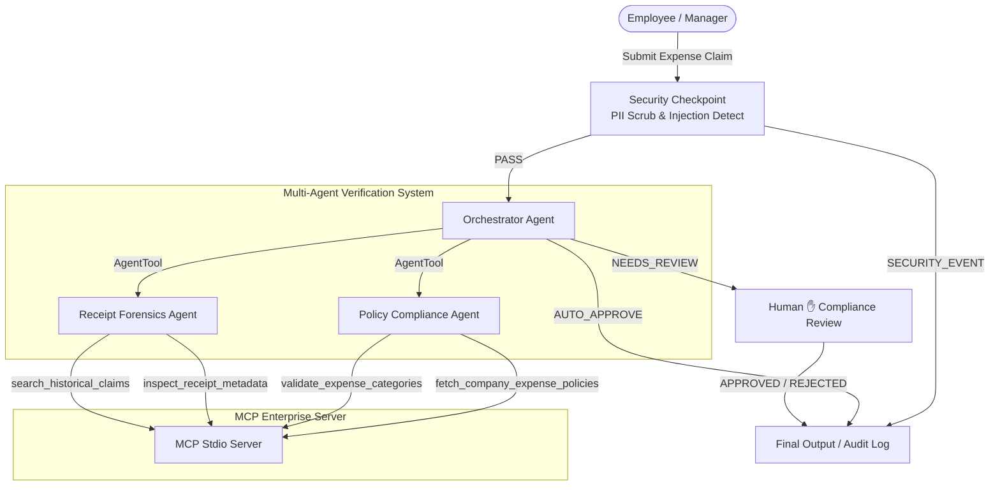
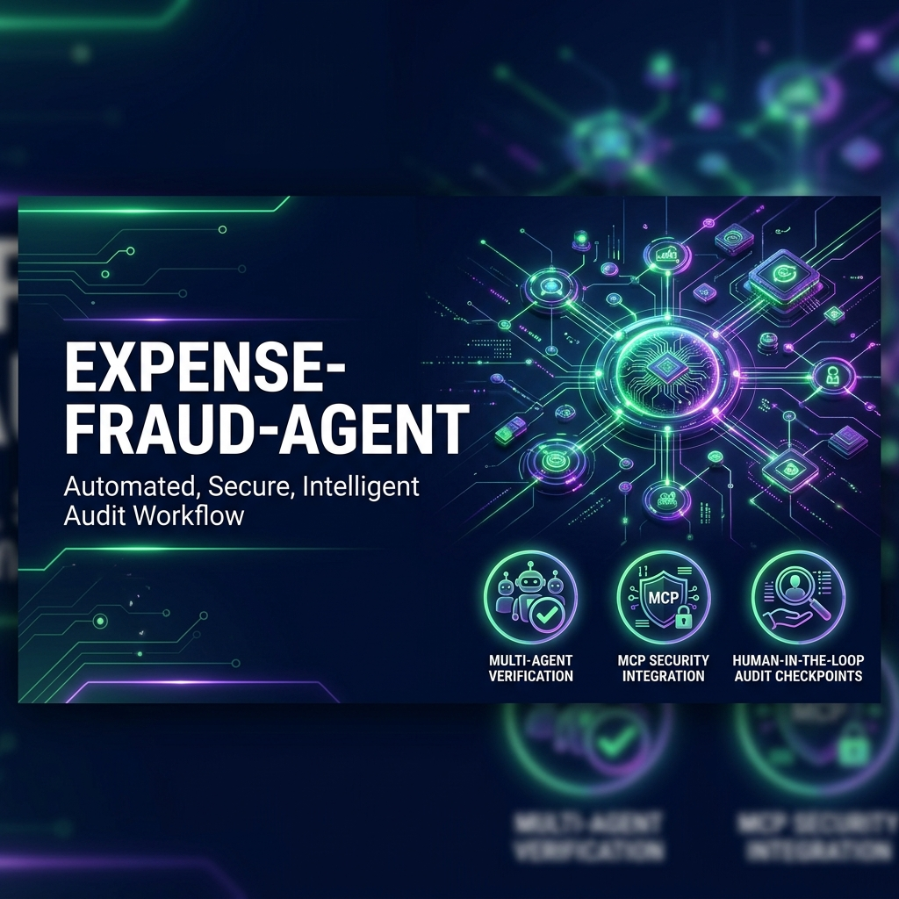
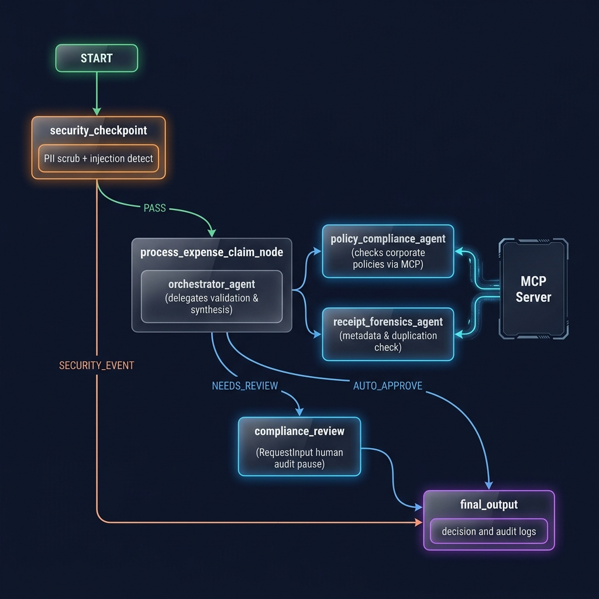

# Real-Time Enterprise Fraud & Expense Verification Agent (`expense-fraud-agent`)

Scans corporate expense reports and receipts via MCP to flag anomalies, enforce company policies, and prevent fraudulent duplicate claims.

## Prerequisites
- **Python 3.11+**
- **uv** (fast Python package manager)
- **Gemini API Key** (get one at [aistudio.google.com/apikey](https://aistudio.google.com/apikey))

## Quick Start

```bash
git clone https://github.com/your-username/expense-fraud-agent.git
cd expense-fraud-agent
cp .env.example .env   # add your GOOGLE_API_KEY
make install
make playground        # opens UI at http://localhost:18081
```

## Architecture Diagram



## Assets

### Project Cover Page Banner


### Agent Workflow Architecture Diagram


## How to Run

- **`make playground`** → launches the interactive ADK web playground UI (http://localhost:18081)
- **`make run`** → local CLI / web server mode

### 💡 Mock Mode (Enabled by Default)
This project is configured with a **Mock Mode** by default. It simulates the agent workflow and tool execution locally for any query, allowing you to test the entire application instantly **without needing a Gemini API key**.
- To test the mock mode dynamically, you can use the sample test cases below or input your own custom expense queries!
- To switch to **Live API Mode** (connecting directly to Google's Gemini models), open [agent.py](file:///c:/Users/zodap/OneDrive/Documents/capestone%20proj/expense-fraud-agent/expense_fraud_agent/agent.py) and change `MockGemini` to `Gemini` in the model definition for the three agents:
  ```python
  # Change:
  model=MockGemini(model=config.model)
  # To:
  model=Gemini(model=config.model)
  ```
  Then, add your valid `GOOGLE_API_KEY` to the `.env` file.

## Sample Test Cases

### Case 1: Standard Valid Meal Expense
- **Input:** `Verify expense claim for employee EMP-1024: $45.50 for dinner at Olive Garden. Receipt ID: REC-123456, Merchant: Olive Garden, Tax: $3.50.`
- **Expected:** `security_checkpoint` passes clean query. `policy_compliance_agent` verifies meal is under $75/day cap. `receipt_forensics_agent` validates tax math and merchant. `orchestrator_agent` routes to `AUTO_APPROVE`.
- **Check:** User sees an `AUTO_APPROVE` decision in the playground UI with clean audit logs.

### Case 2: Duplicate Receipt Fraud Attempt
- **Input:** `Verify expense claim for employee EMP-4092: $250.00 for office supplies at Staples. Receipt ID: REC-998822, Merchant: Staples, Tax: $18.50.`
- **Expected:** `receipt_forensics_agent` queries historical database and flags `REC-998822` as previously reimbursed. `orchestrator_agent` triggers `NEEDS_REVIEW` due to fraud alert.
- **Check:** Playground UI pauses with `RequestInput` prompting the compliance officer to review the duplicate claim alert.

### Case 3: Prohibited Item & PII Exposure
- **Input:** `Claim for employee EMP-5050: $350.00 for Casino Entertainment and Spa. Corporate Card: 4532 7182 9012 3456. Receipt ID: CAS-777, Merchant: Bellagio, Tax: $25.00.`
- **Expected:** `security_checkpoint` scrubs the Credit Card number to `[REDACTED_CREDIT_CARD]`. `policy_compliance_agent` flags Casino/Spa as strictly prohibited. `orchestrator_agent` routes to `NEEDS_REVIEW` / Reject.
- **Check:** Playground UI shows redacted credit card info and an explicit policy violation warning.

## Demo Script

Refer to the [DEMO_SCRIPT.txt](file:///c:/Users/zodap/OneDrive/Documents/capestone%20proj/expense-fraud-agent/DEMO_SCRIPT.txt) file for a complete spoken narration that you can use when demoing this project.

## Troubleshooting

1. **`hatchling.build` OSError: Readme file does not exist**
   - **Cause:** `pyproject.toml` references `README.md`, but the file is missing during `uv sync`.
   - **Fix:** Ensure `README.md` exists in the project root before running `make install` or `uv sync`.

2. **Windows `adk web` fails to reflect code edits**
   - **Cause:** Windows does not support `--reload` due to event loop conflicts with MCP subprocesses.
   - **Fix:** Fully terminate the server using `Get-Process -Id (Get-NetTCPConnection -LocalPort 18081, 8090 -ErrorAction SilentlyContinue).OwningProcess | Stop-Process -Force` and restart.

3. **MCP Server Subprocess Timeout / Connection Error**
   - **Cause:** Incorrect Python path or syntax error in `mcp_server.py`.
   - **Fix:** Run `uv run python expense_fraud_agent/mcp_server.py` directly to verify it starts without syntax tracebacks.

## Push to GitHub

1. Create a new repo at https://github.com/new
   - Name: expense-fraud-agent
   - Visibility: Public or Private
   - Do NOT initialize with README (you already have one)

2. In your terminal, navigate into your project folder:
   ```bash
   cd expense-fraud-agent
   git init
   git add .
   git commit -m "Initial commit: expense-fraud-agent ADK agent"
   git branch -M main
   git remote add origin https://github.com/yashya12/expense-fraud-agent.git
   git push -u origin main
   ```

3. Verify .gitignore includes:
   ```text
   .env          ← your API key — must NEVER be pushed
   .venv/
   __pycache__/
   *.pyc
   .adk/
   ```

⚠ NEVER push .env to GitHub. Your API key will be exposed publicly.
