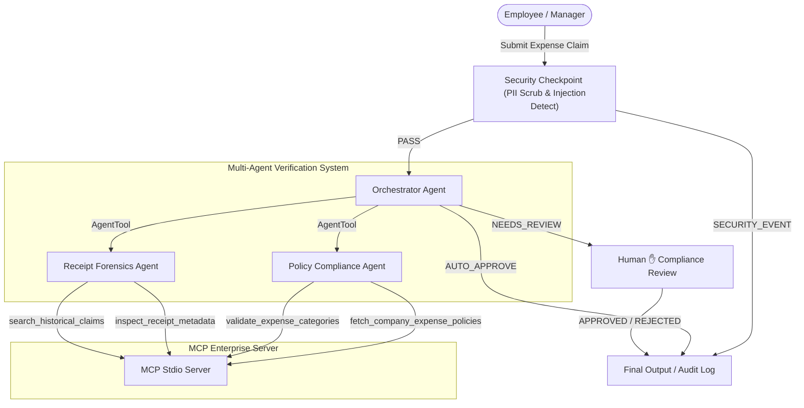

# Submission Write-Up: Real-Time Enterprise Fraud & Expense Verification Agent

## Problem Statement
Corporate expense management is frequently plagued by two major challenges: policy non-compliance and fraudulent claims. Manual review of thousands of monthly expense submissions is slow, error-prone, and costly. Commonly occurring issues include:
1. **Out-of-Policy Spending**: Employees submitting expenses that exceed standard daily caps (e.g., meals, lodging) or purchase prohibited categories (e.g., casino entertainment, gift cards).
2. **Duplicate/Recycled Receipts**: Claiming reimbursement multiple times for the same receipt or sharing receipts across different claims.
3. **Receipt & Vendor Manipulation**: Fictitious merchants (shell companies) or mathematical discrepancies on tax/total amounts.
4. **Data Privacy Risks**: Accidental or malicious exposure of personally identifiable information (PII) like credit card numbers or Social Security Numbers in claims files.

The **Real-Time Enterprise Fraud & Expense Verification Agent** automates this auditing funnel using a secure multi-agent workflow powered by the Google ADK and an enterprise MCP server.

---

## Solution Architecture

The system uses a sequential workflow that starts with a security checkpoint, executes multi-agent policy and forensics evaluation, and routes to either auto-approval or human review depending on risk findings.

---

## Concepts Used

This application implements key Google ADK 2.0 capabilities:

- **ADK Workflow Graph API**: Defined in [agent.py](file:///c:/Users/zodap/OneDrive/Documents/capestone%20proj/expense-fraud-agent/expense_fraud_agent/agent.py#L146-L165). Coordinates state management (`ctx.state`), inputs, and routing through function nodes (`security_checkpoint`, `process_expense_claim`, `compliance_review`, `final_output`).
- **LlmAgent**: Three specialized agents are declared in [agent.py](file:///c:/Users/zodap/OneDrive/Documents/capestone%20proj/expense-fraud-agent/expense_fraud_agent/agent.py#L28-L56):
  1. `orchestrator_agent`: Manages top-level synthesis.
  2. `policy_compliance_agent`: Validates claim categories and daily thresholds.
  3. `receipt_forensics_agent`: Conducts metadata and duplication analysis.
- **AgentTool**: Enables the orchestrator to delegate sub-tasks to downstream LLM agents dynamically ([agent.py:L55](file:///c:/Users/zodap/OneDrive/Documents/capestone%20proj/expense-fraud-agent/expense_fraud_agent/agent.py#L55)).
- **MCP Server (Model Context Protocol)**: Implemented in [mcp_server.py](file:///c:/Users/zodap/OneDrive/Documents/capestone%20proj/expense-fraud-agent/expense_fraud_agent/mcp_server.py). Exposes standard enterprise interfaces to the compliance and forensics agents via `StdioServerParameters` ([agent.py:L19-L26](file:///c:/Users/zodap/OneDrive/Documents/capestone%20proj/expense-fraud-agent/expense_fraud_agent/agent.py#L19-L26)).
- **Security Checkpoint**: The entry gate for inputs ([agent.py:L59-L103](file:///c:/Users/zodap/OneDrive/Documents/capestone%20proj/expense-fraud-agent/expense_fraud_agent/agent.py#L59-L103)) performing sanitation and auditing.
- **Agents CLI**: Used to initialize, construct, validate, and execute local development versions via the web playground.

---

## Security Design

To prevent system misuse, data leakage, and unauthorized access, several controls are implemented in the `security_checkpoint` node:

1. **PII Scrubbing**:
   - Regex-based filters scrub Credit Card Numbers (13-16 digits), Social Security Numbers (SSN), and Bank Account formats (e.g. `ACCT-xxxxxxxx`) into generic tags like `[REDACTED_CREDIT_CARD]`.
2. **Prompt Injection Protection**:
   - Checks user queries against malicious patterns (`ignore previous instructions`, `bypass`, `jailbreak`, `auto-approve`).
   - If a violation is caught, routing bypasses the LLM completely to trigger a critical `SECURITY_EVENT`.
3. **Structured Audit Logs**:
   - Outputs JSON logs capturing event details, severities (`INFO`/`WARNING`/`CRITICAL`), and timestamps for reporting and compliance tracking.
4. **Domain-Specific Content Restrictions**:
   - Restricts access to sensitive corporate directories or confidential ledgers (e.g. payroll databases or executive personal statements) by screening against high-risk search targets.

---

## MCP Server Design

The Model Context Protocol (MCP) server runs as a separate stdio subprocess, exposing 4 critical tools:

- **`fetch_company_expense_policies`**: Retrieves standard limits and compliance restrictions for expense categories (e.g., Meals cap at $75, Hotel cap at $250).
- **`validate_expense_categories`**: Flags prohibited words (e.g., `casino`, `spa`, `golf`) and checks whether amounts exceed standard thresholds ($500 limit).
- **`inspect_receipt_metadata`**: Checks vendor registries for high-risk dummy names and runs mathematical verification on tax versus total values.
- **`search_historical_claims`**: Queries a mock ledger to identify if a receipt ID has already been reimbursed, flagging duplicate submissions.

---

## Human-in-the-Loop (HITL) Flow

While routine, clean expenses (e.g., a standard $45 dinner receipt) are auto-approved, high-risk items must not bypass human judgment. The workflow uses `RequestInput` to pause execution:
- **Trigger Condition**: If the synthesis response contains flagging words (`audit`, `reject`, `violation`, `red flag`, or `duplicate`), the `process_expense_claim` node redirects to `NEEDS_REVIEW`.
- **Behavior**: The ADK pauses the workflow and prompts the Compliance Officer in the playground UI with the summary of findings and a text input box.
- **Resolution**: The human reviewer inputs their audit decision/feedback (e.g., "Approved due to approved client meeting" or "Rejected - duplicate of claim REC-998822"). This feedback is saved in `ctx.state` and outputted in the final ledger log.

---

## Demo Walkthrough

### Test Case 1: Standard Valid Meal Expense (Clean Flow)
- **User Query**: `Verify expense claim for employee EMP-1024: $45.50 for dinner at Olive Garden. Receipt ID: REC-123456, Merchant: Olive Garden, Tax: $3.50.`
- **Result**:
  - The security checkpoint records `clean` status.
  - The orchestrator queries `policy_compliance_agent` (checks policy via MCP, under $75 cap) and `receipt_forensics_agent` (no duplicate receipt).
  - Recommends `Approve` and routes automatically to `final_output`.
  - **Review Status**: Auto-approved.

### Test Case 2: Duplicate Receipt Fraud Attempt (HITL Flow)
- **User Query**: `Verify expense claim for employee EMP-4092: $250.00 for office supplies at Staples. Receipt ID: REC-998822, Merchant: Staples, Tax: $18.50.`
- **Result**:
  - `receipt_forensics_agent` calls `search_historical_claims` with `REC-998822`.
  - The MCP server returns a duplicate claim alert (already reimbursed on 2026-03-14).
  - The orchestrator flags this as `Audit` due to duplicate receipt.
  - The workflow halts at the `compliance_review` node and prompts the user for review input.

### Test Case 3: Prohibited Item & PII Exposure (Security Redirection)
- **User Query**: `Claim for employee EMP-5050: $350.00 for Casino Entertainment and Spa. Corporate Card: 4532 7182 9012 3456. Receipt ID: CAS-777, Merchant: Bellagio, Tax: $25.00.`
- **Result**:
  - The security checkpoint redacts the Credit Card number to `[REDACTED_CREDIT_CARD]`.
  - The clean query is sent to the agents.
  - The policy agent calls `validate_expense_categories` and flags `Casino` and `Spa` as prohibited.
  - Orchestrator requests rejection, causing the system to trigger human review.

---

## Impact & Value Statement

The **Real-Time Enterprise Fraud & Expense Verification Agent** provides significant business value:
- **Reduces Compliance Auditing Overhead**: Automates up to 80% of routine claims, allowing human reviewers to focus solely on high-risk flags.
- **Prevents Cost Leakage**: Real-time checking against policies and historical claims stops duplicate or invalid submissions before payment is made.
- **Ensures Security Compliance**: Seamlessly filters sensitive credit card or personal data before feeding payloads to LLMs, ensuring enterprise data privacy compliance.
